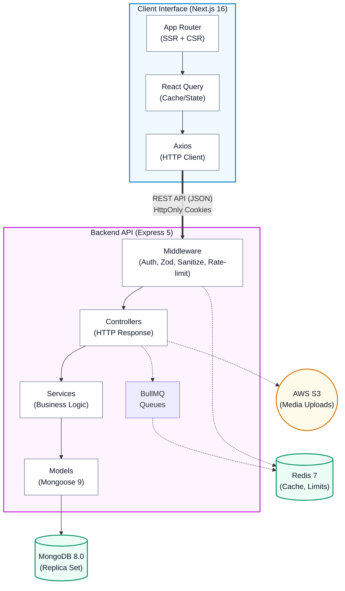

# SkillAnchor — Architecture Document

## 1. High-Level System Overview

SkillAnchor is a full-stack monorepo (`client/` + `server/`) that follows a **decoupled client-server architecture** connected exclusively over a RESTful HTTP API.



**Key architectural decisions:**
- The frontend never touches the JWT directly — authentication is entirely cookie-based (`httpOnly`, `secure`, `sameSite=strict`).
- Heavy side-effects (multi-collection updates on hire events) are offloaded to Redis-backed BullMQ workers to keep the request thread unblocked.
- MongoDB transactions are used for data consistency across the hire pipeline, requiring a replica set topology.

---

## 2. Backend Architecture (`server/src/`)

The backend follows a **strict Layered Architecture** with clean separation of concerns:

### 2.1 Layer Responsibilities

```
Request ──▶ Route ──▶ Middleware ──▶ Controller ──▶ Service ──▶ Model ──▶ DB
                      (validate)     (HTTP glue)   (logic)     (schema)
```

| Layer | Directory | Responsibility |
|---|---|---|
| **Routes** | `routes/` | Maps HTTP verbs/paths to middleware chains and controller callbacks. Pure routing — no logic. |
| **Middleware** | `middleware/` | Cross-cutting guards: JWT auth, role-based access, Zod validation, NoSQL sanitization, request ID injection. |
| **Controllers** | `controllers/` | Receives validated requests, delegates to services or models, and constructs standardized HTTP responses. |
| **Services** | `services/` | Core business logic isolated from HTTP transport. Enables mock-free unit testing. All domain logic (job queries/caching, application transactions, avatar resolution, auth OTP flows, profile operations) lives here. Controllers are thin HTTP adapters only. |
| **Models** | `models/` | Mongoose schemas defining MongoDB collections, indexes, virtuals, and TypeScript interfaces. |
| **Queues** | `queues/` | BullMQ queue producers and workers for asynchronous processing. |
| **Config** | `config/` | Singleton initializations: MongoDB connection, Redis client, S3 client, Zod-validated environment variables, and rate limiter definitions. |
| **Utils** | `utils/` | Leaf utilities: async error wrapper, cache helpers, email sender, JWT token generator, auth cookie setter, and Pino logger instance. `auth.ts` centralizes `generateToken` and `setAuthCookie` — used by all auth flows. |

### 2.2 Module Breakdown

#### Models (8 collections)

| Model | Collection | Key Design Detail |
|---|---|---|
| `User` | `users` | Polymorphic `profile` ref via `refPath: "role"`. Supports `phone` and `email` auth with sparse unique indexes. |
| `WorkerProfile` | `workerprofiles` | Rich profile: skills, languages, documents (Aadhaar/PAN/license), expected salary, completion percentage. One-to-one with User. |
| `EmployerProfile` | `employerprofiles` | Links to Company. Tracks designation, hiring manager status. One-to-one with User. |
| `Company` | `companies` | Multi-location entity with GSTIN, industry, size, verification status. Text index on name. |
| `Job` | `jobs` | Composite text index across 7 fields for full-text search. Search queries use `$and` composition to prevent filter clobbering when combining search + location. Virtual `isExpired` getter. Compound indexes for status + category + location queries. |
| `Application` | `applications` | Status pipeline enum: `pending → viewed → shortlisted → rejected → hired → employment-ended`. Maintains a `statusHistory` array for audit trail. Unique compound index on `(job, applicant)`. |
| `WorkExperience` | `workexperiences` | Can be added by worker or employer. Links to Application (when created via hire flow). Supports ratings, reviews, and verification status. |
| `SavedJob` | `savedjobs` | Simple junction table with unique `(user, job)` index. |

#### Controllers (5 modules)

| Controller | Endpoints | Role-Gated |
|---|---|---|
| `auth.controller` | Register, login, OTP send/verify, password reset, session management | Partially (update flows require auth) |
| `job.controller` | CRUD for jobs, employer's own jobs listing, public search | Employer for writes |
| `application.controller` | Apply, withdraw, view applicants, update status | Worker for apply/withdraw, Employer for status |

#### Services (5 modules)

| Service | Responsibility |
|---|---|
| `auth.service` | OTP generation/verification, brute-force lockout, contact uniqueness checks |
| `job.service` | Job CRUD with field whitelisting, cache-aside reads, full-text + regex search fallback, authority checks (404 vs 403) |
| `application.service` | MongoDB-transactional apply/withdraw, S3 avatar resolution for applicant lists, BullMQ enqueue on hire |
| `profile.service` | Worker and employer profile mutations, completion percentage calculation |
| `profile.controller` | Get/update profiles, avatar management, employer's team view | Authenticated, Employer for team |
| `workExperience.controller` | CRUD, end employment, toggle visibility | Worker for CRUD, flexible for end |

#### Middleware Pipeline (per-request order)

```
1. Helmet          → HTTP security headers
2. Rate Limiter    → Redis-backed IP throttling (100 req/15min global, 20 req/15min strict)
3. NoSQL Sanitize  → Strips dangerous $ operators from body/query/params
4. Compression     → gzip response compression
5. CORS            → Origin whitelist with credentials
6. Cookie Parser   → Extracts HttpOnly JWT cookies
7. Body Parsers    → JSON + URL-encoded
8. Request ID      → UUID injection for log correlation
9. Pino HTTP       → Structured request/response logging
10. Route-level:
    └─ protect()      → JWT verification, user hydration onto req.user
    └─ requireRole()  → Role-based access control
    └─ validate()     → Zod schema validation against body/query/params
```

### 2.3 Background Job Processing

The **Hired Worker Queue** (`queues/hired.queue.ts`) handles the multi-step side-effects when an employer marks an application as "hired":

```
Employer sets status = "hired"
         │
         ▼
Controller pushes job to BullMQ queue
         │
         ▼
┌─────────────────────────────────────────────┐
│  BullMQ Worker (Redis-backed)               │
│                                             │
│  1. Fetch application with populated job    │
│  2. Start MongoDB transaction (session)     │
│  3. Create WorkExperience entry:            │
│     - Linked to application & company       │
│     - Marked as verified, current, by       │
│       employer                              │
│  4. Update WorkerProfile:                   │
│     - Push to workHistory array             │
│     - Set currentlyEmployed = true          │
│  5. Commit transaction                      │
│     (or abort on any failure)               │
└─────────────────────────────────────────────┘
```

This design keeps the hire response fast while ensuring atomicity via MongoDB transactions.

---

## 3. Frontend Architecture (`client/src/`)

### 3.1 Rendering Strategy

Next.js 16 App Router with a **hybrid rendering paradigm**:

- **Server Components** (default): Used for layout shells, page-level data fetching, and SEO content. Reduces client JavaScript payload.
- **Client Components** (`"use client"`): Only opted-in for interactive leaves — forms, modals, search inputs, and authenticated state consumers.
- **React Compiler**: Enabled via `babel-plugin-react-compiler`, auto-memoizes component trees to eliminate manual `useMemo`/`useCallback`.

### 3.2 Directory Structure & Responsibilities

| Directory | Responsibility |
|---|---|
| `app/` | File-system routing. Uses route groups `(auth)`, `(employer)`, `(worker)` for layout segmentation. Each page has `loading.tsx` and `error.tsx` boundaries. |
| `components/` | Domain-grouped reusable components: `common/` (cards, badges, buttons), `layout/` (Navbar, Footer), `modals/`, `profile/`, `profile-edit/`, `settings/`. |
| `hooks/queries/` | React Query hooks wrapping the API client: `useInfiniteJobs`, `useApplications` (mutations + queries), `useProfile`. Handle cache invalidation, optimistic updates. |
| `hooks/ui/` | Complex UI state machines: `useLogin` (multi-step OTP + password flow), `useRegister`. |
| `hooks/index.ts` | Generic hooks: `useDebounce`, `useForm` (form state + validation + error clearing). |
| `context/` | `AuthContext` — global auth state. Hydrates on mount via `GET /auth/get-me`, listens for `auth:unauthorized` browser events to trigger auto-logout. |
| `providers/` | Composition root: wraps children in `QueryClientProvider` (5 min stale time, 30 min GC) + `AuthProvider`. |
| `lib/api.ts` | Centralized Axios instance with base URL, credential forwarding, and 401 interceptor that dispatches `auth:unauthorized` events. Exports typed API modules: `authAPI`, `jobsAPI`, `applicationsAPI`, `profileAPI`, `workExperienceAPI`. |
| `types/` | Shared TypeScript interfaces for all domain entities and API response shapes. |
| `constants/` | Static data: job category names, filter options. |
| `utils/` | Formatting helpers, S3 URL construction. |

### 3.3 State Management

```
┌─────────────────────┐     ┌────────────────────────┐
│  AuthContext         │     │  React Query Cache     │
│  (user session)      │     │  (server state)        │
│                      │     │                        │
│  - user: User|null   │     │  - jobs (infinite)     │
│  - loading: boolean  │     │  - myApplications      │
│  - login/logout      │     │  - profile             │
│  - updateUserData    │     │  - myJobs              │
└─────────────────────┘     │  - jobApplicants       │
                             └────────────────────────┘
```

- **Auth state**: React Context — lightweight, session-scoped, hydrated once on mount.
- **Server state**: TanStack React Query — handles caching, background refetching, pagination (infinite queries), and mutation-driven cache invalidation.
- No global store (Redux, Zustand) is used — the combination of Context + React Query covers all needs.

---

## 4. Data Flow & Request Lifecycle

A complete request cycle from user interaction to UI update:

```
1. User Action (e.g., clicks "Apply")
        │
        ▼
2. React Query Mutation
   └─ Constructs payload, calls API client
        │
        ▼
3. Axios Client
   └─ Attaches credentials (cookies), sends POST to /api/v1/applications/apply/:jobId
        │
        ▼
4. Express Middleware Chain
   └─ Rate limiter → Sanitize → Auth (JWT cookie) → Zod validation
        │
        ▼
5. Controller
   └─ Extracts validated data, calls model/service methods
        │
        ▼
6. Model / Database
   └─ Mongoose operation on MongoDB
   └─ (Optional) Push background job to BullMQ
        │
        ▼
7. Response
   └─ Standardized JSON: { success: true, data: { application: {...} } }
        │
        ▼
8. Client Revalidation
   └─ React Query invalidates related query keys
   └─ Connected UI components re-render with fresh data
```

---

## 5. Security Architecture

### 5.1 Authentication

| Mechanism | Implementation |
|---|---|
| **JWT Storage** | `httpOnly`, `secure`, `sameSite=strict` cookies. Frontend JavaScript never accesses the token — prevents XSS-based token theft. |
| **Token Verification** | `protect` middleware decodes the JWT, fetches the user from the database (excluding the password field), and attaches it to `req.user`. |
| **Password Hashing** | bcrypt with default cost factor. |
| **OTP Flow** | 6-digit codes stored in Redis with TTL, delivered via Nodemailer SMTP. Used for passwordless login, contact updates, and password reset. |

### 5.2 Authorization

- **Role-Based Access Control (RBAC)**: `requireRole("employer")` / `requireRole("worker")` middleware. Three roles: `worker`, `employer`, `admin`.
- **Resource ownership**: Controllers verify that the requesting user owns the resource before mutations (e.g., only the job owner can update/delete their listing).

### 5.3 Input Validation & Sanitization

| Layer | Mechanism |
|---|---|
| **Schema Validation** | Zod schemas at the route level validate `body`, `query`, and `params`. Invalid requests never reach controllers. |
| **NoSQL Injection Prevention** | Dedicated middleware strips any key starting with `$` from request body, query, and params — blocks operators like `$gt`, `$ne`, `$regex`. |
| **Mass-Assignment Prevention** | `job.service.ts` whitelists all allowed fields in `createJob` and `updateJob`. Controllers never forward raw `req.body` to the database layer. |
| **Environment Validation** | `config/env.ts` validates all environment variables at startup via Zod. Missing or malformed variables cause immediate process exit with descriptive errors. |

### 5.4 Transport Security

| Measure | Detail |
|---|---|
| **Helmet** | Sets security headers: CSP, X-Frame-Options, X-Content-Type-Options, etc. |
| **CORS** | Strict origin allowlist (`CLIENT_URL`), credentials enabled. |
| **Rate Limiting** | Redis-backed via `express-rate-limit` + `rate-limit-redis`. Two tiers: API-wide (100 req/15 min), strict (20 req/15 min) on job posting and application submission. |
| **File Upload** | MIME type whitelist (`image/jpeg`, `image/png`, `image/webp`), 0.5 MB size cap, folder whitelist to prevent path traversal, and sanitized filenames. |

---

## 6. Caching & Performance

### 6.1 Server-Side

| Strategy | Implementation |
|---|---|
| **Redis Caching** | `utils/cache.ts` implements cache-aside with **tag-based invalidation**. Each cached key is registered in a Redis SET (`tag:{name}`). Invalidation resolves the set in O(1) — no full-keyspace SCAN required. |
| **ETag** | Express `etag: 'strong'` for conditional GET responses. |
| **Response Compression** | gzip via `compression` middleware. |
| **Database Indexing** | Strategic compound and text indexes on all high-query-volume collections. See model files for index definitions. |
| **Task Offloading** | BullMQ workers process expensive multi-collection updates asynchronously. |

### 6.2 Client-Side

| Strategy | Implementation |
|---|---|
| **React Query Cache** | 5-minute stale time, 30-minute garbage collection. Prevents redundant API calls across route transitions. |
| **Infinite Queries** | Job listing uses `useInfiniteQuery` for paginated data with smooth scroll-based loading. |
| **React Compiler** | Automatic memoization of component trees at compile time — eliminates React re-render overhead. |
| **List Virtualization** | React Virtuoso for rendering large lists without DOM bloat. |
| **Image Optimization** | `next/image` for responsive, lazy-loaded images. Remote patterns configured for S3 and Clearbit. |
| **Font Optimization** | `next/font` with Inter and Plus Jakarta Sans — self-hosted, zero layout shift. |

---

## 7. Testing Strategy

### 7.1 Backend Testing

- **Framework**: Vitest (ESM-native, parallel execution disabled for integration tests via `--fileParallelism=false`).
- **Database Isolation**: `mongodb-memory-server` spins up an in-memory replica set per test suite. No shared state, no external database dependency.
- **HTTP Testing**: Supertest performs full request-response cycle testing against the Express app without starting a real server.
- **Coverage**: V8 provider with thresholds enforced: 80% statements, 80% functions, 70% branches, 80% lines.

**Test suites (15 files):**
`health`, `auth.routes`, `auth.service`, `job`, `application`, `profile.controller`, `workExperience`, `hired.queue`, `cache`, `cache.unit`, `email.service`, `sanitize`, `security`, `upload.routes`

### 7.2 Frontend Testing

- **Framework**: Vitest with jsdom environment.
- **Component Testing**: React Testing Library with `@testing-library/user-event` for realistic interaction simulation.
- **Coverage**: V8 provider with thresholds: 70% statements, 69% functions, 60% branches, 70% lines.

**Test suites (11 files):**
`AuthForm`, `Dashboard`, `JobCard`, `Listing`, `MyJobs`, `Navbar`, `SearchHero`, `useLogin`, `utils`, `simple`

---

## 8. Error Handling

### 8.1 Server

The global error handler in `app.ts` classifies errors and returns consistent responses:

| Error Type | HTTP Status | Response |
|---|---|---|
| Malformed JSON | 400 | `"Invalid JSON"` |
| Mongoose `ValidationError` | 400 | Concatenated field error messages |
| Mongoose `CastError` | 400 | `"Invalid {path}: {value}"` |
| MongoDB duplicate key (code 11000) | 400 | `"Duplicate value detected"` |
| Zod validation failure | 400 | Joined issue messages |
| Unhandled/unknown | 500 | `"Internal Server Error"` + logged with Pino |

### 8.2 Client

- **Route-level error boundaries**: `error.tsx` files at each route level catch rendering errors with user-friendly fallbacks.
- **Loading states**: `loading.tsx` files provide suspense boundaries with skeleton/loading UI.
- **404 handling**: Custom `not-found.tsx` at the app root.
- **API error interception**: Axios interceptor on 401 responses dispatches a browser `auth:unauthorized` event. The `AuthContext` listens for this event and triggers automatic logout with query cache clearing.

---

## 9. Configuration & Environment Architecture

Environment configuration is **fail-fast**: the server validates all variables at startup via Zod and exits with descriptive errors on any failure.

| Variable | Required | Validated As | Purpose |
|---|---|---|---|
| `PORT` | No (default: 5000) | Number | Server listen port |
| `MONGO_URI` | ✅ | URL | MongoDB connection string |
| `JWT_SECRET` | ✅ | String (min 32 chars) | JWT signing secret |
| `CLIENT_URL` | ✅ | URL | CORS origin allowlist |
| `REDIS_URL` | Optional | URL | Redis connection (rate limiting, caching, BullMQ) |
| `AWS_*` / `S3_*` | Optional | Strings | S3 file upload configuration |
| `EMAIL_*` | Optional | Strings | SMTP configuration for OTP delivery |

---

## 10. Known Architectural Trade-offs

| Trade-off | Implication |
|---|---|
| **MongoDB Replica Set requirement** | Transactions in the hire pipeline require replica set topology. **MongoDB Atlas (all tiers including M0 free) provisions a 3-node replica set automatically** — no configuration needed. For local development outside of tests, run `mongod --replSet rs0` or use `mongodb-memory-server`. |
| **Cookie-based auth + CORS** | `sameSite=strict` cookies require client and API to share sibling domains or use a reverse proxy in production. Cross-origin deployments will break session management without proper configuration. |
| **No WebSocket layer** | All communication is request-response. Real-time features (messaging, live notifications) are not supported. See planned improvements. |
| **Monolithic Express process** | BullMQ workers run in the same process as the HTTP server. At scale, these should be separated into dedicated worker processes. |
| **No admin panel** | The `admin` role exists in the User model but has no dedicated routes, controllers, or frontend views. |

---

## 11. Planned Improvements

| Enhancement | Description |
|---|---|
| **Real-Time Messaging** | Socket.io or WebSocket integration for bidirectional employer-candidate communication within the platform. |
| **Worker Process Separation** | Extract BullMQ workers into separate deployable units for independent scaling. |
| **Admin Dashboard** | Build out the admin role with user management, job moderation, and analytics. |
| **Push Notifications** | Web push for application status updates and new job alerts. |
| **Full-Text Search Upgrade** | Migrate from MongoDB text indexes to Atlas Search or Elasticsearch for more advanced ranking and faceted search. |
